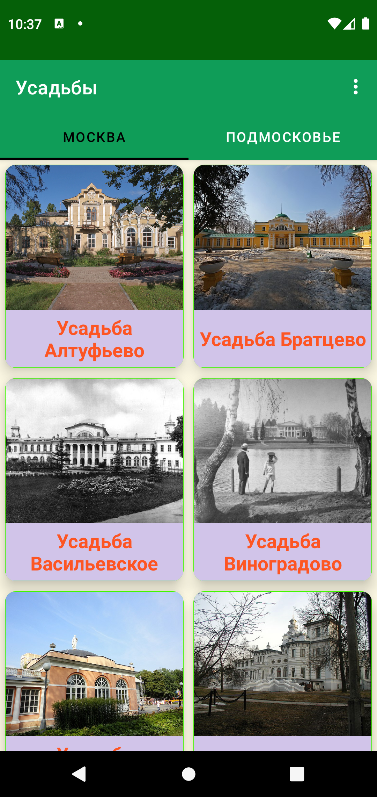
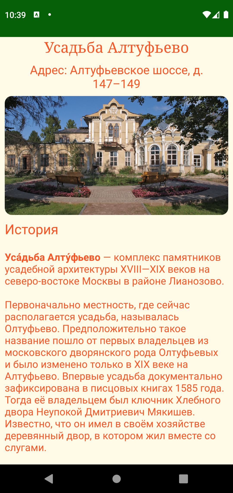

  <h2>Усадьбы Москвы и Подмосковья
    

    Здравствуйте. Разработал и опубликовал приложение в PlayMarket. Работает без интернета. Делал в качестве справочника по усадьбам. Применил цветовую гамму из Material Design. Содержит 2 экрана, а так же возможность почитать об усадьбах в браузере. Пока что несколько скачиваний. 
    

     
    

     

 

     

